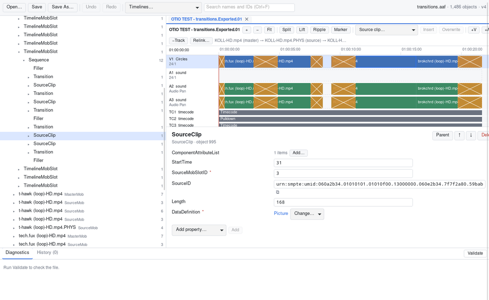

# AAF Editor

A from-scratch C++ library, command-line tool and cross-platform desktop editor for **AAF (Advanced Authoring
Format)** files, the interchange format used by Avid Media Composer, Pro Tools, DaVinci Resolve and other
post-production tools.



- **Lossless:** opening and saving an unmodified file reproduces its structure and every byte of every stream. Unknown and vendor-specific data is preserved.
- **Everything is editable:**
  - the full object graph, including extension classes defined in the file;
  - a timeline view with split, lift, ripple delete, trims, move, insert/overwrite, tracks, markers and media relinking.
- **Safe:** every change is a validated, atomic, undoable command. Changes that would break the file's structure or leave references dangling are refused.
- **Verified against other implementations:**
  - pyaaf2 reads everything we read and write identically, across 58 reference files from the AAF SDK, pyaaf2 and OpenTimelineIO;
  - the OpenTimelineIO AAF adapter reads our timelines, including edited ones, the same way we do.

## Download

Get the latest build from [Releases](https://github.com/claude-coder-collab/aaf-editor/releases):

| Platform | File |
|---|---|
| Linux (Debian 13+, Ubuntu 24.04+) | `.deb` or `.tar.gz` |
| macOS 13.3+ | `.dmg` (universal) |
| Windows 10/11 | `.zip` |

Builds are not code-signed. The release notes explain how to open them on macOS and Windows.

## Using the editor

`aafedit [file.aaf]` opens the editor, optionally with a file.

- **Object tree (left):** every object in the file. Large collections load on demand. Search (Ctrl+F) finds objects by name, AUID or MobID.
- **Properties (right):** a type-aware editor for every property:
  - numbers with range checks, enumerations, identifiers, records and arrays;
  - references to other objects, and replacing or extracting embedded media;
  - adding and removing optional properties and child objects.
- **Timeline (top right):** opens for the first top-level composition. Use the Timelines menu or a mob's Timeline button for others.
  - Click the ruler to set the playhead.
  - Drag clips to move them, and drag edges to trim (hold Alt to ripple).
  - Keys: S splits, Delete lifts, Shift+Delete ripple-deletes, M adds a marker.
  - Clicking a clip shows its source chain; clips with missing sources are red.
- **Diagnostics and History (bottom):** Validate checks the whole file, and clicking a history entry undoes or redoes to that point.
- **File shortcuts:** Ctrl+O, Ctrl+S, Ctrl+Shift+S, Ctrl+Z, Ctrl+Shift+Z.

## Using `aaftool`

```
aaftool validate file.aaf              # check a file against the AAF object model
aaftool dump file.aaf --header         # print the object tree (--json for machine-readable output)
aaftool timeline file.aaf              # print the first composition's tracks and clips
aaftool roundtrip in.aaf out.aaf       # load and save again (lossless)
aaftool extract file.aaf --list        # list embedded media; extract with: extract file.aaf 0 out.bin
aaftool rpc in.aaf --call timeline.op '{"op":"relink","find":"/old/","replace":"/new/"}' --save out.aaf
```

See [docs/aaftool.md](docs/aaftool.md) for every command.

## Building

You need CMake 3.28+, Ninja, a C++26-capable compiler, Node.js 20+ and Python 3.11+. CI builds with GCC 14,
Clang 22, MSVC 19.51 (Visual Studio 2026) and the current Xcode's AppleClang. On Linux you also need WebKitGTK 4.1
(`libwebkit2gtk-4.1-dev`).

```
cmake --preset gcc                  # or clang / msvc
cmake --build --preset gcc-release
ctest --preset gcc-release
```

See [docs/building.md](docs/building.md) for options, sanitizers, fuzzing and the reference fixtures.
[SPEC.md](SPEC.md) is the complete specification and design record.

## Licence

MIT; see [LICENSE](LICENSE). Third-party components are listed in [NOTICE](NOTICE). The sample AAF files in
`tests/fixtures/aafsdk` come from the AAF SDK and keep its licence (see `tests/fixtures/aafsdk/LEGAL`). The AAF
specification PDFs are not redistributable; `python3 tools/fetch_specs.py` downloads them to `docs/reference/`.
